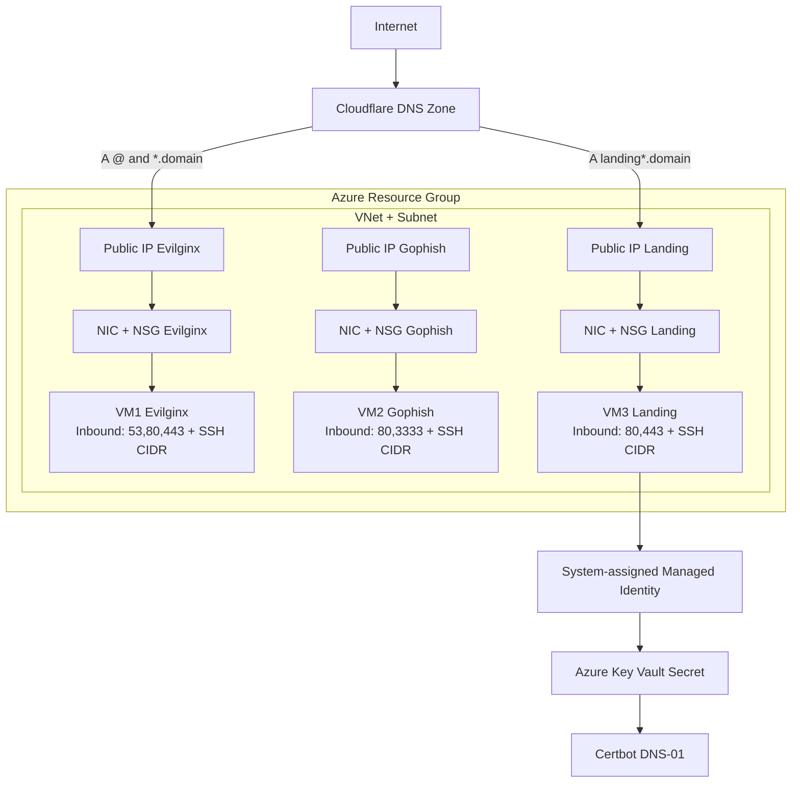

# terraform-azure-evilginx

Terraform module for authorized client security engagements that deploys a 3-VM Azure stack:

- `VM1` Evilginx
- `VM2` Gophish
- `VM3` HTTPS landing page (nginx + certbot)

It also manages Cloudflare DNS:

- Root (`@`) A record -> Evilginx VM public IP
- Optional wildcard (`*`) A record -> Evilginx VM public IP (disabled by default)
- Landing subdomain A records -> Landing VM public IP

## What You Deploy

| Component | Purpose | Public Ports |
|---|---|---|
| `vm-evilginx-*` | Evilginx reverse proxy host (built from source) | `53`, `80`, `443` + `22` (restricted) |
| `vm-gophish-*` | Gophish campaign manager (systemd service) | `80`, `3333` (restricted) + `22` (restricted) |
| `vm-landing-*` | Landing web host with Let's Encrypt TLS via DNS-01 | `80`, `443` + `22` (restricted) |

Every VM gets:

- Dedicated static public IP
- Dedicated NIC + NSG
- Ubuntu 22.04 image (pinned version required)

## Architecture



- SSH access to all VMs is restricted to `allowed_ssh_cidr`.
- Gophish admin `:3333` is restricted to `allowed_ssh_cidr`.

## Quick Start (Recommended)

This is the fastest path using `examples/complete`.

### 1. Prerequisites

- Terraform `>= 1.6.0, < 2.0.0`
- Azure CLI authenticated (`az login`)
- Azure subscription ID
- Cloudflare-managed domain
- Cloudflare API token with at least `Zone:DNS:Edit`
- SSH public key (`ssh-ed25519` or `ssh-rsa`)

### 2. Clone and enter the example

```bash
git clone https://github.com/4renwald/terraform-azure-evilginx.git
cd terraform-azure-evilginx/examples/complete
cp terraform.tfvars.example terraform.tfvars
```

### 3. Put Cloudflare token in Azure Key Vault (for landing certbot)

If you already have a Key Vault and secret, skip to step 4.

```bash
# Adjust names/location as needed
az group create -n rg-redteam-secrets -l eastus
az keyvault create -n kv-redteam-secrets-<unique> -g rg-redteam-secrets -l eastus --enable-rbac-authorization true

# Store your Cloudflare DNS token in Key Vault
az keyvault secret set \
  --vault-name kv-redteam-secrets-<unique> \
  --name cloudflare-dns-token \
  --value "<YOUR_CLOUDFLARE_TOKEN>"

# Capture values used by terraform
KV_ID=$(az keyvault show --name kv-redteam-secrets-<unique> --query id -o tsv)
KV_SECRET_URI=$(az keyvault secret show --vault-name kv-redteam-secrets-<unique> --name cloudflare-dns-token --query id -o tsv)

echo "$KV_ID"
echo "$KV_SECRET_URI"
```

### 4. Fill `terraform.tfvars`

Required values you must set:

```hcl
domain_name                             = "example.com"
allowed_ssh_cidr                        = "203.0.113.10/32"
ssh_public_key                          = "ssh-ed25519 AAAA..."
cloudflare_zone_id                      = "<YOUR_ZONE_ID>"
certbot_email                           = "ops@example.com"
landing_cloudflare_api_token_secret_uri = "https://<vault>.vault.azure.net/secrets/<secret>/<version>"
cloudflare_api_token_key_vault_id       = "/subscriptions/<sub>/resourceGroups/<rg>/providers/Microsoft.KeyVault/vaults/<vault>"
ubuntu_image_version                    = "22.04.202501150"
```

The `examples/complete` stack exposes all module inputs in `examples/complete/main.tf`, and `examples/complete/terraform.tfvars.example` includes commented overrides for every optional capability.

Tips:

- Set `allowed_ssh_cidr` to your public IP with `/32`.
- If the pinned Ubuntu image version is unavailable in your region, pick another available version for:
  - Publisher: `Canonical`
  - Offer: `0001-com-ubuntu-server-jammy`
  - SKU: `22_04-lts-gen2`
- To deploy your own landing content (`index.html` plus folders like `assets/`), set `landing_site_dir` in `examples/complete/terraform.tfvars` (for example `landing_site_dir = "./landing-site"`). The example converts that directory into files written under `/var/www/landing`.

Lookup command:

```bash
az vm image list \
  --location eastus \
  --publisher Canonical \
  --offer 0001-com-ubuntu-server-jammy \
  --sku 22_04-lts-gen2 \
  --all --query "[-1].version" -o tsv
```

### 5. Export runtime credentials

```bash
export ARM_SUBSCRIPTION_ID="<YOUR_AZURE_SUBSCRIPTION_ID>"

# Used by the Cloudflare Terraform provider (DNS records)
export TF_VAR_cloudflare_api_token="<YOUR_CLOUDFLARE_TOKEN>"
```

Token usage note:

- `TF_VAR_cloudflare_api_token` is consumed by Terraform's Cloudflare provider during `plan/apply`.
- `landing_cloudflare_api_token_secret_uri` is consumed on the landing VM at runtime (certbot) via Key Vault.
- You can use the same token value for both, but separate scoped tokens are recommended for least privilege and easier rotation.

### 6. Deploy

```bash
terraform init
terraform plan
terraform apply
```

### 7. Verify

```bash
# Outputs
terraform output

# SSH
ssh azureadmin@$(terraform output -raw evilginx_public_ip)
ssh azureadmin@$(terraform output -raw gophish_public_ip)
ssh azureadmin@$(terraform output -raw landing_public_ip)

# Landing TLS check
curl -I https://$(terraform output -raw landing_fqdn)

# Gophish service check
ssh azureadmin@$(terraform output -raw gophish_public_ip) 'sudo systemctl status gophish --no-pager'
```

### 8. Destroy

```bash
terraform destroy
```

## Most Important Inputs

| Input | Required | Notes |
|---|---|---|
| `domain_name` | Yes | Base domain in Cloudflare |
| `cloudflare_zone_id` | Yes | Zone ID for `domain_name` |
| `cloudflare_api_token` | Yes (runtime/provider) | Prefer env var `TF_VAR_cloudflare_api_token` |
| `landing_cloudflare_api_token_secret_uri` | Yes | Key Vault secret URI used on landing VM |
| `landing_site_files_base64` | No | Optional map of site file paths -> base64 content written to `/var/www/landing` |
| `cloudflare_api_token_key_vault_id` | Yes (default flow) | Vault ID for auto role assignment to landing MSI |
| `certbot_email` | Yes | Let's Encrypt registration email |
| `landing_subdomain` | Yes | Landing subdomain label |
| `ubuntu_image_version` | Yes | Must be pinned, `latest` is blocked |
| `ssh_public_key` | Yes | Public key string |
| `allowed_ssh_cidr` | Yes | Must be `/24` or narrower; `/32` recommended |

## Complete Input Reference

| Input | Default | Purpose |
|---|---|---|
| `domain_name` | n/a | Base domain managed in Cloudflare |
| `cloudflare_zone_id` | n/a | Cloudflare zone ID for `domain_name` |
| `cloudflare_api_token` | `null` | Cloudflare provider auth token (typically via env var) |
| `landing_cloudflare_api_token_secret_uri` | n/a | Key Vault secret URI used by landing certbot |
| `cloudflare_api_token_key_vault_id` | `null` | Key Vault ID for landing MSI role assignment |
| `assign_key_vault_role_to_landing_vm` | `true` | Auto-assign Key Vault Secrets User to landing MSI |
| `certbot_email` | n/a | Let's Encrypt registration email |
| `landing_subdomain` | n/a | Primary landing hostname label |
| `landing_additional_subdomains` | `[]` | Additional landing hostnames |
| `landing_cloudflare_proxied` | `true` | Proxy landing DNS records through Cloudflare |
| `landing_page_html` | built-in HTML | Inline fallback landing page content |
| `landing_site_files_base64` | `{}` | Full landing site files map (`path => base64`) |
| `allowed_ssh_cidr` | n/a | SSH/Gophish admin source CIDR allowlist |
| `ssh_public_key` | n/a | SSH public key for VM login |
| `admin_username` | `azureadmin` | Linux admin username on all VMs |
| `resource_group_name` | `rg-redteam-phishing` | Resource group name |
| `location` | `East US` | Azure region |
| `prefix` | `redteam` | Name prefix used for resources |
| `evilginx_vm_size` | `Standard_B2s` | Evilginx VM SKU |
| `gophish_vm_size` | `Standard_B2s` | Gophish VM SKU |
| `landing_vm_size` | `Standard_B2s` | Landing VM SKU |
| `ubuntu_image_version` | n/a | Pinned Ubuntu image version |
| `vnet_address_space` | `["10.0.0.0/16"]` | VNet CIDR blocks |
| `subnet_address_prefix` | `["10.0.1.0/24"]` | Subnet CIDR blocks |
| `restrict_outbound_traffic` | `true` | Enable deny-all baseline egress + explicit allows |
| `cloudflare_dns_allow_overwrite` | `false` | Allow managed Cloudflare records to overwrite existing |
| `create_wildcard_evilginx_record` | `false` | Create wildcard `*.<domain_name>` A record to Evilginx |
| `enable_evilginx_managed_identity` | `false` | Enable MSI on Evilginx VM |
| `enable_gophish_managed_identity` | `false` | Enable MSI on Gophish VM |
| `log_analytics_workspace_id` | `null` | Optional NSG diagnostics sink |
| `evilginx_repo_ref` | pinned SHA | Evilginx source ref |
| `gophish_repo_ref` | pinned SHA | Gophish source ref |
| `go_version` | `1.22.5` | Go version used during build |
| `go_linux_amd64_tarball_sha256` | pinned SHA256 | Go tarball integrity pin |
| `tags` | `{}` | Additional tags merged onto resources |

## Example-Only Convenience Input

`examples/complete` also adds one helper input that is not part of the root module API:

- `landing_site_dir`: local folder path that the example converts into `landing_site_files_base64` using `fileset` + `filebase64`.

## Security Defaults

- SSH and Gophish admin access restricted to `allowed_ssh_cidr`
- Egress restriction enabled by default (`restrict_outbound_traffic = true`)
- Cloudflare DNS overwrite disabled by default (`cloudflare_dns_allow_overwrite = false`)
- Landing certbot token is retrieved from Key Vault at boot (not embedded in Terraform-rendered cloud-init)
- Evilginx/Gophish managed identities are off by default

## Using as a Child Module

This repository is a module and does not define active provider blocks in root. Configure providers in your own root module.

```hcl
provider "azurerm" {
  features {}
}

provider "cloudflare" {
  api_token = var.cloudflare_api_token
}

module "redteam" {
  source = "github.com/4renwald/terraform-azure-evilginx"

  domain_name                             = "example.com"
  cloudflare_zone_id                      = "<zone-id>"
  cloudflare_api_token                    = var.cloudflare_api_token
  certbot_email                           = "ops@example.com"
  landing_subdomain                       = "landing"
  landing_site_files_base64               = { for rel in fileset("${path.module}/landing-site", "**") : rel => filebase64("${path.module}/landing-site/${rel}") }
  landing_cloudflare_api_token_secret_uri = "https://<vault>.vault.azure.net/secrets/<secret>/<version>"
  cloudflare_api_token_key_vault_id       = "/subscriptions/<sub>/resourceGroups/<rg>/providers/Microsoft.KeyVault/vaults/<vault>"
  ubuntu_image_version                    = "22.04.202501150"
  ssh_public_key                          = file("~/.ssh/id_ed25519.pub")
  allowed_ssh_cidr                        = "203.0.113.10/32"
}
```

## Outputs

- `evilginx_public_ip`
- `gophish_public_ip`
- `landing_public_ip`
- `landing_fqdn`
- `landing_fqdns`
- `landing_url`
- `evilginx_vm_principal_id` (`null` if identity disabled)
- `gophish_vm_principal_id` (`null` if identity disabled)
- `landing_vm_principal_id`

## Troubleshooting

- `Unrecognized remote plugin message` during `terraform validate/test`:
  - Usually execution environment restrictions. Run Terraform in a normal local shell/runner.
- Certbot fails on first boot:
  - Key Vault RBAC propagation can take a short time. Re-run certbot on landing VM after permissions propagate.
- `ubuntu_image_version` rejected or unavailable:
  - Use the image lookup command above for your target region.

## Authorized Use Only

Use this module only for authorized security assessments with written permission.

## License

MIT
